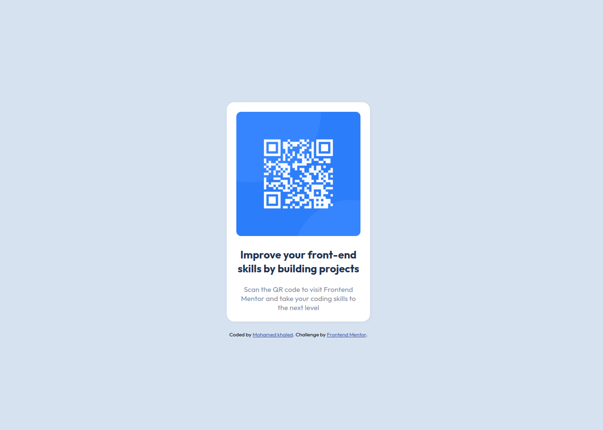
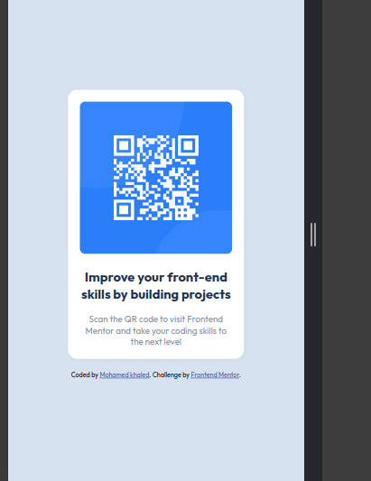

# Frontend Mentor - QR code component solution

This is a solution to the [QR code component challenge on Frontend Mentor](https://www.frontendmentor.io/challenges/qr-code-component-iux_sIO_H). Frontend Mentor challenges help you improve your coding skills by building realistic projects.

## Table of contents

- [Frontend Mentor - QR code component solution](#frontend-mentor---qr-code-component-solution)
  - [Table of contents](#table-of-contents)
  - [Overview](#overview)
    - [Screenshot](#screenshot)
    - [Links](#links)
  - [My process](#my-process)
    - [Built with](#built-with)
    - [What I learned](#what-i-learned)
    - [Continued development](#continued-development)
    - [Useful resources](#useful-resources)
  - [Author](#author)
  - [Acknowledgments](#acknowledgments)

## Overview

### Screenshot

#### desktop-design

#### mobile-design

### Links

- Solution URL: 
- Live Site URL: )

## My process

### Built with

- Semantic HTML5 markup
- CSS custom properties
- Flexbox
- Mobile-first workflow

### What I learned

During this project, I learned how to effectively use semantic HTML and CSS custom properties. 

### Continued development

In future projects, I want to focus on improving my JavaScript skills and exploring more advanced CSS techniques, such as CSS Grid.

### Useful resources
  - [CSS LAYOUTS](https://almdrasa.com/tracks/frontend/courses/css-layouts/)  -  Helped me understand Flexbox and other CSS concepts better.
- [MDN Web Docs](https://developer.mozilla.org/) - An invaluable resource for web development documentation.

## Author

- Website - [Mohamed khaled](https://www.linkedin.com/in/mohamed-khaled-full-stack/)
- Frontend Mentor - [@Mohamed-khaled](https://www.frontendmentor.io/profile/Mohamed-khaled-mohmamed)

## Acknowledgments

Special thanks to Engineer [ Mohamed Aabusrea](https://github.com/mohamedabusrea) 

and  [@Almdrasa](https://github.com/Almdrasa) platform for guiding me through this project. Their support and resources were invaluable in completing this challenge.

